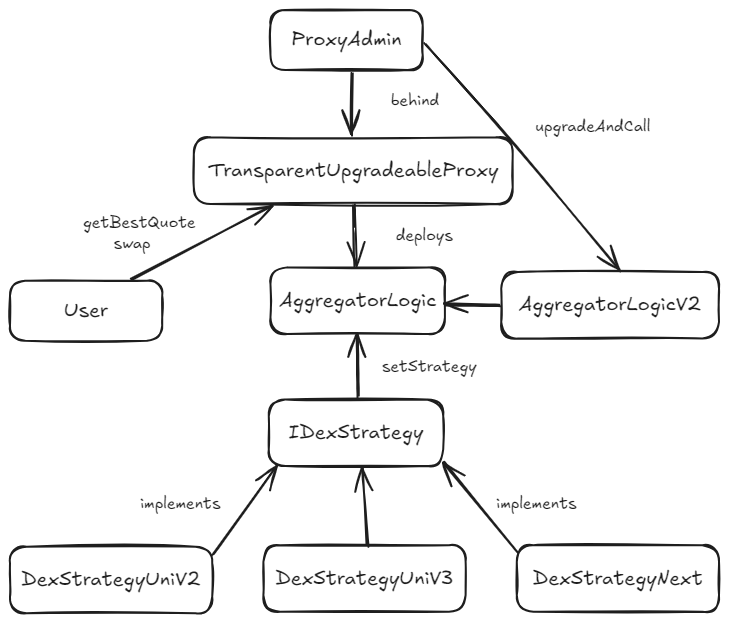

# DEX Aggregator Protocol

A modular and upgradeable DEX aggregator protocol that supports multiple DEX strategies, currently including Uniswap V2 and V3.

## Protocol Architecture



The protocol follows a modular design with the following key components:

1. **ProxyAdmin**: Administrative contract that manages the upgrade process and controls the proxy
2. **TransparentUpgradeableProxy**: Proxy contract that delegates calls to the current implementation while maintaining state
3. **AggregatorLogic**: Core implementation contract that:
   - Manages DEX strategies
   - Routes user swaps to the best DEX (`getBestQuote`, `swap`)
   - Can be upgraded to newer versions (e.g., AggregatorLogicV2)
4. **IDexStrategy**: Standard interface that all DEX strategies must implement
5. **Strategy Implementations**: Concrete implementations for different DEX protocols:
   - DexStrategyUniV2 (Uniswap V2)
   - DexStrategyUniV3 (Uniswap V3)
   - DexStrategyNext (Future implementations)

## Features

- Modular and upgradeable design
- Support for multiple DEX protocols
- Standardized strategy interface
- Quote and swap functionality
- Strategy management by owner

## Project Structure

```
├── contracts/
│   ├── AggregatorLogic.sol         # Main aggregator contract
│   ├── AggregatorLogicV2.sol       # Upgraded version
│   ├── interfaces/
│   │   ├── IDexStrategy.sol        # Strategy interface
│   │   ├── IUniswapV2Router02.sol
│   │   ├── IUniswapV3Quoter.sol
│   │   └── IUniswapV3SwapRouter.sol
│   └── strategies/
│       ├── DexStrategyUniV2.sol    # Uniswap V2 implementation
│       └── DexStrategyUniV3.sol    # Uniswap V3 implementation
├── script/
│   └── DeployAggregator.s.sol      # Deployment script for the aggregator
├── test/
│   ├── AggregatorTest.t.sol        # Core aggregator functionality tests
│   ├── AggregatorUpgradeTest.t.sol # Upgrade functionality tests
│   ├── UniswapV2ForkTest.t.sol     # Uniswap V2 integration tests
│   └── UniswapV3ForkTest.t.sol     # Uniswap V3 integration tests
├── lib/                            # External dependencies
├── assets/
│   └── diagram.png                 # Diagram
```

## Setup and Installation

1. Clone the repository
2. Install dependencies:
   ```bash
   forge install
   ```
3. Create a `.env` file with necessary environment variables:
   ```
   ETH_RPC_URL=
   PRIVATE_KEY=
   ```

## Usage

### Deploying the Protocol

1. Deploy the AggregatorLogic contract
2. Deploy strategy contracts
3. Register strategies using `setStrategy`

### Interacting with the Protocol

1. Get quotes using `getQuote`
2. Execute swaps using `swap`

### Upgrading the Protocol

The protocol uses OpenZeppelin's upgradeable pattern with a proxy. To upgrade the implementation:

1. Deploy the new implementation contract (e.g., AggregatorLogicV2)
2. Call `upgradeAndCall` on the ProxyAdmin contract with the new implementation address and initialization data:
   ```solidity
   proxyAdmin.upgradeAndCall(
       ITransparentUpgradeableProxy(address(proxy)),
       address(logicImplV2),
       data
   );
   ```

The upgrade preserves all state and strategies while allowing for new functionality to be added. The `upgradeAndCall` function allows for atomic upgrades with initialization in a single transaction.

## Testing

Run tests using:
```bash
forge test --fork-url $ETH_RPC_URL -vvv
```

Make sure you have set the `ETH_RPC_URL` environment variable with your Ethereum node URL.

## License

MIT License 